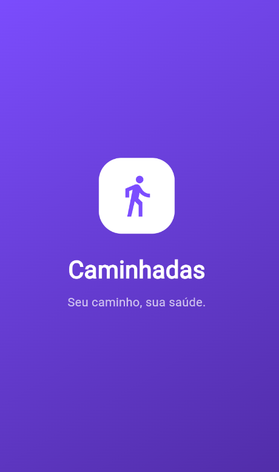
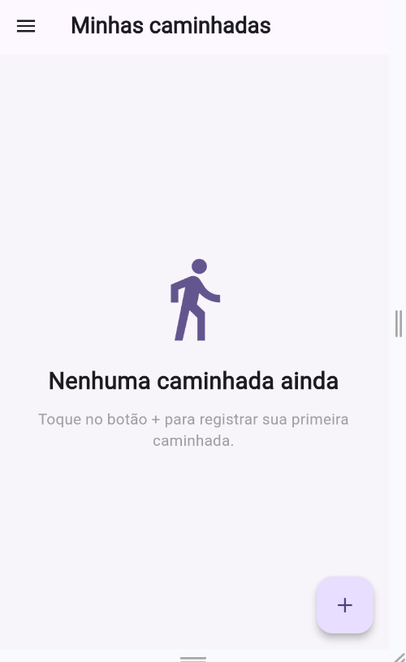
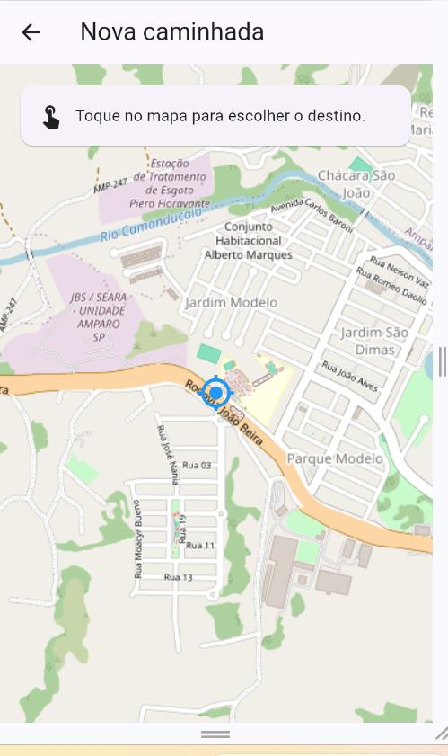
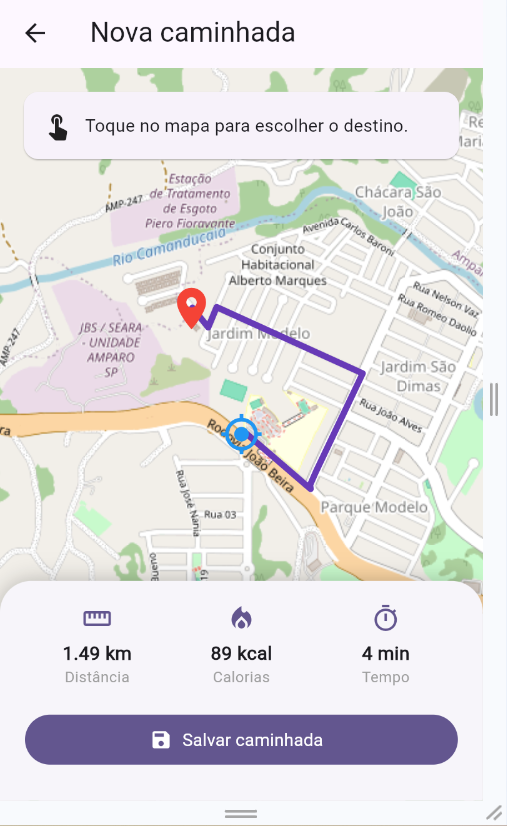
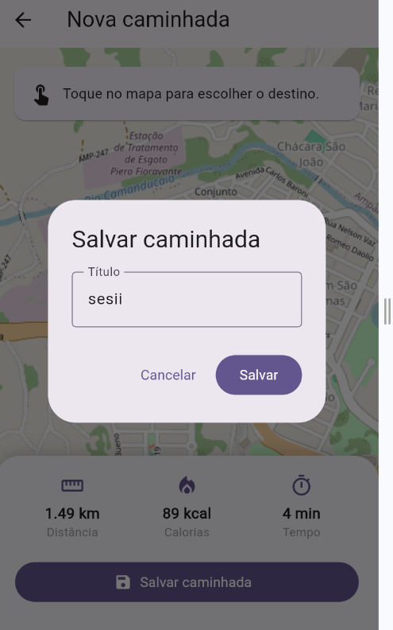
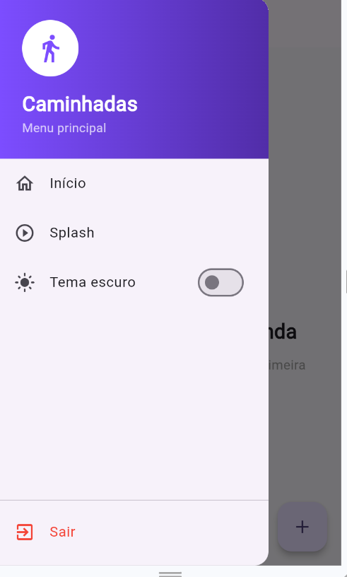
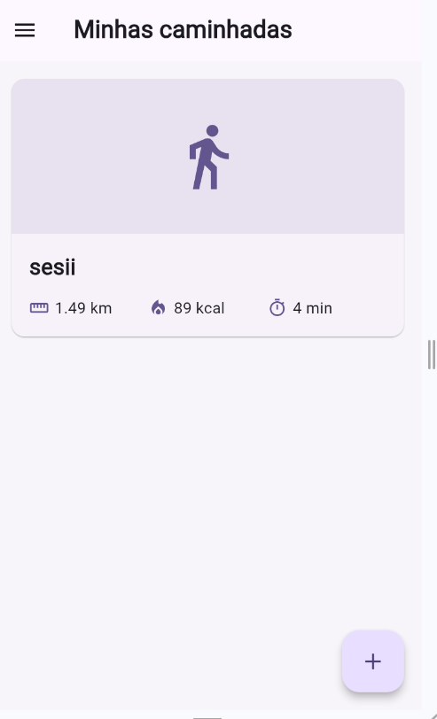
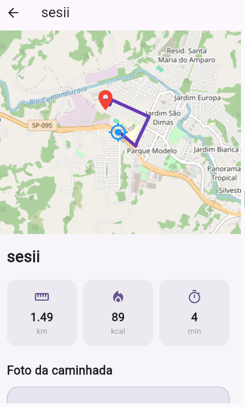
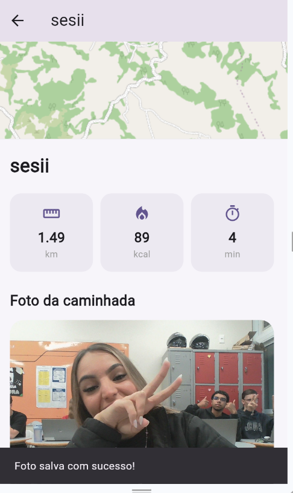

# App Caminhadas

Aplicativo desenvolvido em Flutter como parte da atividade **Desafio - App Caminhadas**. O projeto permite criar e salvar caminhadas utilizando localização, mapas, cálculo de rotas e informações como distância, tempo e calorias.

A aplicação possui uma interface simples e organizada, com suporte a tema claro e escuro e armazenamento local das caminhadas realizadas.

---

## Sobre o projeto

O **App Caminhadas** foi desenvolvido para registrar caminhadas de forma prática. O usuário pode visualizar sua localização no mapa, escolher um destino, calcular uma rota e salvar a caminhada para consultar posteriormente.

O projeto utiliza o **Flutter Map** com **OpenStreetMap** para exibição dos mapas e o serviço **OSRM** para calcular as rotas.

---

## Funcionalidades

* Tela de splash com animação.
* Tela inicial com as caminhadas salvas.
* Menu lateral (Drawer).
* Tema claro e tema escuro.
* Identificação da localização atual.
* Mapa interativo.
* Seleção do destino diretamente no mapa.
* Cálculo de rota para caminhada.
* Exibição da rota no mapa.
* Cálculo da distância em quilômetros.
* Estimativa de calorias.
* Estimativa do tempo da caminhada.
* Salvamento da caminhada com título.
* Armazenamento local dos dados.
* Tela de detalhes da caminhada.
* Possibilidade de adicionar foto da caminhada.
* Visualização da rota salva.

---

## Tecnologias utilizadas

* **Flutter**
* **Dart**
* **Flutter Map**
* **OpenStreetMap**
* **OSRM**
* **Geolocator**
* **Image Picker**
* **Shared Preferences**
* **HTTP**
* **LatLong2**

---

## Pacotes utilizados

### flutter_map

Utilizado para criar o mapa interativo dentro da aplicação.

### latlong2

Utilizado para trabalhar com coordenadas geográficas e posições no mapa.

### geolocator

Responsável por obter a localização atual do dispositivo e calcular distâncias.

### http

Utilizado para realizar a comunicação com o serviço de rotas OSRM.

### image_picker

Utilizado para selecionar ou capturar imagens para adicionar à caminhada.

### shared_preferences

Utilizado para armazenar localmente as caminhadas salvas.

---

## Mapa e rotas

O aplicativo utiliza o **OpenStreetMap** para apresentar o mapa.

A rota é calculada utilizando o **OSRM (Open Source Routing Machine)**, através de uma requisição HTTP.

O processo funciona da seguinte forma:

1. O aplicativo obtém a localização inicial.
2. O usuário toca em um ponto do mapa para escolher o destino.
3. As coordenadas inicial e final são enviadas ao OSRM.
4. O serviço retorna a rota.
5. A aplicação transforma os pontos recebidos em coordenadas do mapa.
6. A rota é apresentada visualmente através de uma linha.
7. A distância e o tempo são exibidos para o usuário.

Caso não seja possível obter a rota pela internet, o aplicativo utiliza uma estimativa baseada na distância entre os pontos.

---

## Armazenamento

As caminhadas são armazenadas localmente utilizando o **Shared Preferences**.

Cada caminhada possui informações como:

* ID;
* título;
* localização inicial;
* localização de destino;
* distância;
* calorias;
* tempo;
* pontos da rota;
* foto, quando adicionada.

---

# 📱 Prints do aplicativo

Abaixo estão alguns registros das principais telas desenvolvidas no projeto.

### Splash




---

### Pagina inicial 




---

### Mapa



---

### Marca caminhada 





---

### Menu




---

### Informações da caminhada





---

### Foto caminhada



Exibição da distância, calorias e tempo estimados para a caminhada.

---

## Estrutura do projeto

```text
lib/
│
├── main.dart
│
├── models/
│   └── caminhada.dart
│
├── services/
│   └── storage_service.dart
│
├── screens/
│   ├── splash.dart
│   ├── home.dart
│   ├── nova_caminhada.dart
│   └── detalhes_caminhada.dart
│
└── widgets/
    └── menu_drawer.dart
```

---

## Como executar o projeto

### Clonar o repositório

```bash
git clone URL_DO_REPOSITORIO
```

### Entrar na pasta

```bash
cd caminhadas_app
```

### Instalar as dependências

```bash
flutter pub get
```

### Executar no Chrome

```bash
flutter run -d chrome
```

### Executar no Android

```bash
flutter devices
flutter run
```

---

## Gerando o APK

```bash
flutter clean
flutter pub get
flutter build apk --release
```

O APK será gerado em:

```text
build/app/outputs/flutter-apk/app-release.apk
```

---

## Testes realizados

Durante o desenvolvimento foram realizados testes para verificar:

* abertura da aplicação;
* funcionamento da Splash;
* navegação entre as telas;
* menu lateral;
* tema claro e escuro;
* localização;
* interação com o mapa;
* seleção do destino;
* cálculo da rota;
* distância;
* calorias;
* tempo;
* salvamento da caminhada;
* carregamento das caminhadas;
* tela de detalhes;
* adição de foto;
* execução no navegador;
* geração do APK em modo release.

---

## Resultado

O projeto apresenta uma aplicação funcional para registro de caminhadas, reunindo localização, mapas, cálculo de rotas, informações da caminhada, armazenamento local, fotos e personalização de tema em uma única aplicação Flutter.

---

## Desenvolvido por

**Livia Morais Pereira**

Projeto desenvolvido para atividade do **SENAI – Desenvolvimento de Sistemas**.
